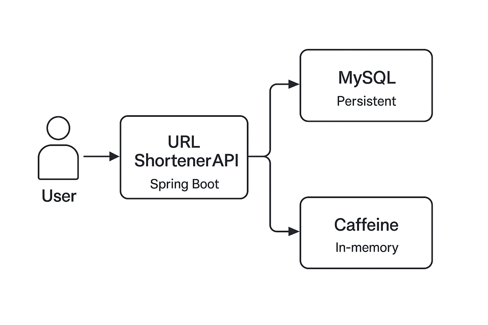

# urlShortenerJhipster

This application was generated using JHipster 8.11.0, you can find documentation and help
at [https://www.jhipster.tech/documentation-archive/v8.11.0](https://www.jhipster.tech/documentation-archive/v8.11.0).

# Project Overview

The URL Shortener Service provides an API for shortening long URLs into unique, compact short codes that can later be
expanded back to their original form.
It is designed with scalability, performance, and clean architecture in mind, making it suitable for large-scale use
cases.

# Core Features

| Feature                  | Description                                                                |
| ------------------------ | -------------------------------------------------------------------------- |
| URL Shortening           | Accepts long URLs and generates unique shortened URLs.                     |
| URL Expansion & Redirect | Resolves a shortened URL to its original form and redirects the user.      |
| Expiry Management        | Shortened URLs automatically expire after a configurable retention period. |
| Validation               | Ensures only valid HTTP/HTTPS URLs are accepted.                           |
| Testing & Coverage       | Unit tests cover core logic, edge cases, and failure scenarios.            |
| Containerization         | Supports Docker deployment with docker-compose.                            |

# Setup Instructions

## Local Setup (without Docker)

### 1. Prerequisites

- JDK 17+

- Maven 3.8+

- PostgreSQL or MySQL (configurable in application.yml)

- Optional: Docker (for containerization)

### 2. Clone and Build

```
git clone https://github.com/AliBondar/url-shortener-jhipster.git
cd url-shortener-jhipster
mvn clean install
```

### 3. Run the Application

```
mvn spring-boot:run
```

The service will start on: http://localhost:8080

### 4. Configure Expiry & DB

```yaml
short-url:
  expiry-days: 30 # URLs expire after 30 days
spring:
  datasource:
    url: jdbc:mysql://localhost:3306/shorturldb
    username: root
    password: test
```

# API Endpoints

## 1. Shorten URL

POST /api/short-urls

Request:

```
{
"originalUrl": "https://www.example.com/some/very/long/link"
}
```

Response:

```
{
"shortCode": "XyZ12a",
"shortUrl": "http://localhost:8080/api/short-urls/XyZ12a",
"expiryDate": "2025-12-01"
}
```

## 2. Get Original URL

GET /api/short-urls/get-short-url/{shortCode}

Response(200):

```
"https://www.example.com/some/very/long/link"
```

Response(404):

```
{
"error": "Short code not found",
"code": 404
}
```

## 3. Redirect Short URL

GET /redirect/{shortCode}
Redirects directly to the original URL.

# Expiry And Storage Behavior

- Each shortened URL has an expiry date, configurable via short-url.expiry-days.

Expired URLs are:

- Skipped during lookup requests.

- Soft-deleted or hard-deleted via a scheduled cleanup job.

Database table short_url contains:

```
id BIGINT PRIMARY KEY,
original_url VARCHAR(2048),
short_code VARCHAR(10) UNIQUE,
expiry_at LOCALDATE,
created_at LOCALDATE,
access_count NUMBER,
active BOOLEAN DEFAULT TRUE
```

# Design Decisions

## 1. Scalability

- Stateless API layer allows easy horizontal scaling.
- Database indexing on short_code ensures O(1) lookup.
- Caching for frequently accessed short codes using Caffeine.

## 2. Storage Optimization

- Only stores short_code, original_url, expiry_date, and active flag.
- Expired links are periodically purged.
- URLs are normalized before storage to avoid duplicates.

## 3. Security

- Only allows HTTP/HTTPS schemes (no FTP or file URLs).
- Input validated against malicious scripts or open redirects.
- Sensitive data (DB credentials) managed via environment variables or Kubernetes Secrets.

## 4. High Load Handling

- Database connection pool tuned with HikariCP.
- Caching layer (Caffeine) reduces DB pressure.
- Uses asynchronous logging and non-blocking I/O.

# C4 Architecture (Container Level)



# Technologies

| Layer             | Technology / Tool                                                |
| ----------------- | ---------------------------------------------------------------- |
| Backend           | Java 17, Spring Boot, JPA/Hibernate, HikariCP, Spring Scheduling |
| Database          | MySQL (containerized)                                            |
| Security          | JWT Authentication                                               |
| Caching           | Caffeine (in-memory cache)                                       |
| Build & Packaging | Maven                                                            |
| Containerization  | Docker, docker-compose                                           |
| Testing           | JUnit 5, Mockito                                                 |
| Versioning & Git  | Semantic Versioning, Conventional Commits                        |

## Project Structure

Node is required for generation and recommended for development. `package.json` is always generated for a better
development experience with prettier, commit hooks, scripts and so on.

In the project root, JHipster generates configuration files for tools like git, prettier, eslint, husky, and others that
are well known and you can find references in the web.

`/src/*` structure follows default Java structure.

- `.yo-rc.json` - Yeoman configuration file
  JHipster configuration is stored in this file at `generator-jhipster` key. You may find `generator-jhipster-*` for
  specific blueprints configuration.
- `.yo-resolve` (optional) - Yeoman conflict resolver
  Allows to use a specific action when conflicts are found skipping prompts for files that matches a pattern. Each line
  should match `[pattern] [action]` with pattern been a [Minimatch](https://github.com/isaacs/minimatch#minimatch)
  pattern and action been one of skip (default if omitted) or force. Lines starting with `#` are considered comments and
  are ignored.
- `.jhipster/*.json` - JHipster entity configuration files

- `npmw` - wrapper to use locally installed npm.
  JHipster installs Node and npm locally using the build tool by default. This wrapper makes sure npm is installed
  locally and uses it avoiding some differences different versions can cause. By using `./npmw` instead of the
  traditional `npm` you can configure a Node-less environment to develop or test your application.
- `/src/main/docker` - Docker configurations for the application and services that the application depends on

## Development

The build system will install automatically the recommended version of Node and npm.

We provide a wrapper to launch npm.
You will only need to run this command when dependencies change in [package.json](package.json).

```
./npmw install
```

We use npm scripts and [Angular CLI][] with [Webpack][] as our build system.

Run the following commands in two separate terminals to create a blissful development experience where your browser
auto-refreshes when files change on your hard drive.

```
./mvnw
./npmw start
```

Npm is also used to manage CSS and JavaScript dependencies used in this application. You can upgrade dependencies by
specifying a newer version in [package.json](package.json). You can also run `./npmw update` and `./npmw install` to
manage dependencies.
Add the `help` flag on any command to see how you can use it. For example, `./npmw help update`.

The `./npmw run` command will list all the scripts available to run for this project.

### PWA Support

JHipster ships with PWA (Progressive Web App) support, and it's turned off by default. One of the main components of a
PWA is a service worker.

The service worker initialization code is disabled by default. To enable it, uncomment the following code
in `src/main/webapp/app/app.config.ts`:

```typescript
ServiceWorkerModule.register('ngsw-worker.js', {enabled: false}),
```

### Managing dependencies

For example, to add [Leaflet][] library as a runtime dependency of your application, you would run following command:

```
./npmw install --save --save-exact leaflet
```

To benefit from TypeScript type definitions from [DefinitelyTyped][] repository in development, you would run following
command:

```
./npmw install --save-dev --save-exact @types/leaflet
```

Then you would import the JS and CSS files specified in library's installation instructions so that [Webpack][] knows
about them:
Edit [src/main/webapp/app/app.config.ts](src/main/webapp/app/app.config.ts) file:

```
import 'leaflet/dist/leaflet.js';
```

Edit [src/main/webapp/content/scss/vendor.scss](src/main/webapp/content/scss/vendor.scss) file:

```
@import 'leaflet/dist/leaflet.css';
```

Note: There are still a few other things remaining to do for Leaflet that we won't detail here.

For further instructions on how to develop with JHipster, have a look at [Using JHipster in development][].

### Using Angular CLI

You can also use [Angular CLI][] to generate some custom client code.

For example, the following command:

```
ng generate component my-component
```

will generate few files:

```
create src/main/webapp/app/my-component/my-component.component.html
create src/main/webapp/app/my-component/my-component.component.ts
update src/main/webapp/app/app.config.ts
```

## Building for production

### Packaging as jar

To build the final jar and optimize the urlShortenerJhipster application for production, run:

```
./mvnw -Pprod clean verify
```

This will concatenate and minify the client CSS and JavaScript files. It will also modify `index.html` so it references
these new files.
To ensure everything worked, run:

```
java -jar target/*.jar
```

Then navigate to [http://localhost:8080](http://localhost:8080) in your browser.

Refer to [Using JHipster in production][] for more details.

### Packaging as war

To package your application as a war in order to deploy it to an application server, run:

```
./mvnw -Pprod,war clean verify
```

### JHipster Control Center

JHipster Control Center can help you manage and control your application(s). You can start a local control center
server (accessible on http://localhost:7419) with:

```
docker compose -f src/main/docker/jhipster-control-center.yml up
```

## Testing

### Spring Boot tests

To launch your application's tests, run:

```
./mvnw verify
```

### Client tests

Unit tests are run by [Jest][]. They're located near components and can be run with:

```
./npmw test
```

## Others

### Code quality using Sonar

Sonar is used to analyse code quality. You can start a local Sonar server (accessible on http://localhost:9001) with:

```
docker compose -f src/main/docker/sonar.yml up -d
```

Note: we have turned off forced authentication redirect for UI in [src/main/docker/sonar.yml](src/main/docker/sonar.yml)
for out of the box experience while trying out SonarQube, for real use cases turn it back on.

You can run a Sonar analysis with using
the [sonar-scanner](https://docs.sonarqube.org/display/SCAN/Analyzing+with+SonarQube+Scanner) or by using the maven
plugin.

Then, run a Sonar analysis:

```
./mvnw -Pprod clean verify sonar:sonar -Dsonar.login=admin -Dsonar.password=admin
```

If you need to re-run the Sonar phase, please be sure to specify at least the `initialize` phase since Sonar properties
are loaded from the sonar-project.properties file.

```
./mvnw initialize sonar:sonar -Dsonar.login=admin -Dsonar.password=admin
```

Additionally, Instead of passing `sonar.password` and `sonar.login` as CLI arguments, these parameters can be configured
from [sonar-project.properties](sonar-project.properties) as shown below:

```
sonar.login=admin
sonar.password=admin
```

For more information, refer to the [Code quality page][].

### Docker Compose support

JHipster generates a number of Docker Compose configuration files in the [src/main/docker/](src/main/docker/) folder to
launch required third party services.

For example, to start required services in Docker containers, run:

```
docker compose -f src/main/docker/services.yml up -d
```

To stop and remove the containers, run:

```
docker compose -f src/main/docker/services.yml down
```

[Spring Docker Compose Integration](https://docs.spring.io/spring-boot/reference/features/dev-services.html) is enabled
by default. It's possible to disable it in application.yml:

```yaml
spring:
  ...
  docker:
    compose:
      enabled: false
```

You can also fully dockerize your application and all the services that it depends on.
To achieve this, first build a Docker image of your app by running:

```sh
npm run java:docker
```

Or build a arm64 Docker image when using an arm64 processor os like MacOS with M1 processor family running:

```sh
npm run java:docker:arm64
```

Then run:

```sh
docker compose -f src/main/docker/app.yml up -d
```

For more information refer to [Using Docker and Docker-Compose][], this page also contains information on the Docker
Compose sub-generator (`jhipster docker-compose`), which is able to generate Docker configurations for one or several
JHipster applications.

## Continuous Integration (optional)

To configure CI for your project, run the ci-cd sub-generator (`jhipster ci-cd`), this will let you generate
configuration files for a number of Continuous Integration systems. Consult the [Setting up Continuous Integration][]
page for more information.

[JHipster Homepage and latest documentation]: https://www.jhipster.tech
[JHipster 8.11.0 archive]: https://www.jhipster.tech/documentation-archive/v8.11.0
[Using JHipster in development]: https://www.jhipster.tech/documentation-archive/v8.11.0/development/
[Using Docker and Docker-Compose]: https://www.jhipster.tech/documentation-archive/v8.11.0/docker-compose
[Using JHipster in production]: https://www.jhipster.tech/documentation-archive/v8.11.0/production/
[Running tests page]: https://www.jhipster.tech/documentation-archive/v8.11.0/running-tests/
[Code quality page]: https://www.jhipster.tech/documentation-archive/v8.11.0/code-quality/
[Setting up Continuous Integration]: https://www.jhipster.tech/documentation-archive/v8.11.0/setting-up-ci/
[Node.js]: https://nodejs.org/
[NPM]: https://www.npmjs.com/
[Webpack]: https://webpack.github.io/
[BrowserSync]: https://www.browsersync.io/
[Jest]: https://jestjs.io
[Leaflet]: https://leafletjs.com/
[DefinitelyTyped]: https://definitelytyped.org/
[Angular CLI]: https://angular.dev/tools/cli
